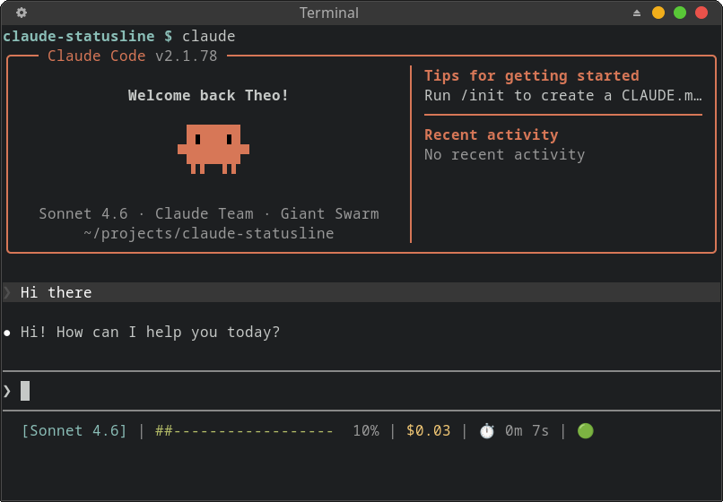
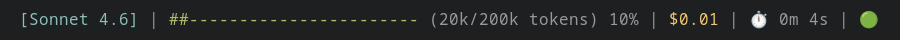

<div align="center">

# claude-statusline

🚀 A fast and configurable [status line](https://code.claude.com/docs/en/statusline) for [Claude Code](https://claude.ai/code) sessions.


[](https://github.com/TheoBrigitte/claude-statusline/releases)
[](https://github.com/TheoBrigitte/claude-statusline/actions/workflows/build.yaml)
[](https://github.com/TheoBrigitte/claude-statusline/releases)
  [](https://scorecard.dev/viewer/?uri=github.com/TheoBrigitte/claude-statusline//pkg.go.dev/badge/github.com/TheoBrigitte/claude-statusline.svg)](https://pkg.go.dev/github.com/TheoBrigitte/claude-statusline)
[](https://github.com/TheoBrigitte/claude-statusline/blob/main/LICENSE)

<p align="center">
    
</p>

</div>

`claude-statusline` adds a status line to your Claude Code sessions to track context window usage, costs, Claude API status, and your session duration. It is fully customizable with multi-segment modules via a TOML config file — colors, layout, thresholds, Nerd Font icons, and more.

## Features

📦 **Modules** — each independently configurable:
- **Model** — active Claude model name (e.g. `[Opus 4.6]`)
- **Context bar** — visual progress bar of context window usage (`###------`)
- **Context tokens** — numeric token counts with SI formatting (e.g. `42k/200k tokens`)
- **Context percentage** — context usage as a percentage (e.g. `5%`)
- **Cost** — session cost in USD (`$1.23`)
- **Duration** — total API duration (`4m 5s`)
- **Status** — live Claude API health from `status.claude.com` with 10-minute file-based cache (🟢/🟡/🔴)
- **Rate limits** — 5-hour and 7-day usage limits with usage %, reset countdown, and threshold colors (`󰊚 5h: 42% ~2h30m`)

⚙️ **Configuration** (TOML):
- Per-module: `disabled`, `style`, `symbol`, `format` (`{value}`/`{symbol}` placeholders, plus `{reset}` on rate limits), `min_term_width`, `max_term_width`
- Threshold-based styling on cost, context bar, and rate limits (warn/critical with different colors)
- Custom line layout templates — modules are `$tokens` placed freely in line strings
- Context bar customization: width, fill/empty characters

🎨 **Simple styling**:
- Named colors (`red`, `cyan`, `bright_green`…), 24-bit hex (`fg:#c792ea`, `bg:#1a1a2e`)
- Modifiers: `bold`, `dim`, `italic`, `underline` — freely composable

📏 **Responsive layout**:
- Auto-wrapping: segments overflow to new lines when exceeding terminal width
- Per-module `min_term_width` and `max_term_width` to hide based on terminals width
- Terminal width detection via `/dev/tty` (works with piped stdin)

🚀 **Performance**:
- Designed with speed in mind, and compiled as a static Golang binary.
- Extremely fast rendering < 0.019 ms
- See [performance benchmarks](#performance)

## ⚡ Install

### 🚀 Method 1: curl installer (recommended)

```sh
OS=linux; ARCH=amd64
curl --create-dirs -sSLo ~/.local/bin/claude-statusline "https://github.com/TheoBrigitte/claude-statusline/releases/latest/download/claude-statusline.$OS-$ARCH"
chmod +x ~/.local/bin/claude-statusline
```

Also supports linux, darwin (macOS), and windows on amd64 and arm64, see [Makefile](Makefile).

This downloads the binary to `~/.local/bin/claude-statusline`.

### 📦 Method 2: go install

Requires the Golang toolchain.

```sh
go install github.com/TheoBrigitte/claude-statusline@latest
```

After installing the binary, configure it into Claude Code in `~/.claude/settings.json`:

```json
{
  "statusLine": { "type": "command", "command": "claude-statusline" }
}
```

Works out of the box with sensible defaults — no config file needed. The default
output looks like:

<p align="center">
    
</p>

### Command-line flags

| Flag                | Description                                                     |
|---------------------|-----------------------------------------------------------------|
| `--config <path>`   | Path to a config file (overrides the default discovery order)   |
| `--log-file <path>` | Append each raw status JSON update as a line to a `.jsonl` file |
| `--debug`           | Verbose logging to stderr                                       |

## ⚙️ Configuration

To customize, create `~/.config/claude-statusline.toml`:

```toml
[model]
style = "bold cyan"
symbol = "󰚩 "        # Nerd Font robot icon

[cost]
warn_threshold = 2.0
warn_style = "yellow"
critical_threshold = 5.0
critical_style = "bold red"

[context_bar]
width = 20
fill_char = "█"
empty_char = "░"
warn_threshold = 40.0
warn_style = "yellow"
critical_threshold = 80.0
critical_style = "bold red"
```

Config file discovery order:

1. `--config <path>` flag
2. `~/.config/claude-statusline.toml`
3. Built-in defaults

### Global Settings

```toml
# Separator between segments (also the line-wrap breakpoint)
separator = " | "

# Terminal padding reserved on the right
padding = 5

# Layout — each entry is one line, segments separated by `|` auto-wrap
# Available tokens: $model $context_bar $context_tokens $context_pct $rate_5h $rate_7d $cost $duration $status
lines = ["$model | $context_bar $context_tokens $context_pct | $rate_5h $rate_7d | $cost | $duration | $status"]
```

### Modules

Every module supports these fields:

| Field            | Type   | Description                                               |
|------------------|--------|-----------------------------------------------------------|
| `disabled`       | bool   | Hide this module entirely                                 |
| `style`          | string | ANSI style (see [Styles](#styles))                        |
| `symbol`         | string | Prefix prepended to the value (supports Nerd Font glyphs) |
| `format`         | string | Format string with `{value}` and `{symbol}` placeholders  |
| `min_term_width` | int    | Only show when terminal is at least this wide             |
| `max_term_width` | int    | Only show when terminal is at most this wide              |

#### `[model]` — Model Name

Displays the active Claude model name.

| Field            | Default       | Description                        |
|------------------|---------------|------------------------------------|
| `style`          | `"cyan"`      | ANSI style                         |
| `format`         | `"[{value}]"` | Wraps name in brackets by default  |
| `min_term_width` | `80`          | Hidden on narrow terminals         |

```toml
[model]
style = "bold fg:#7aa2f7"
symbol = "󰚩 "              # nf-md-robot
format = "{symbol}{value}"   # drop the brackets
```

#### `[context_bar]` — Context Window Progress Bar

Visual bar showing context window usage. Supports threshold-based color changes.

| Field                | Default    | Description                                  |
|----------------------|------------|----------------------------------------------|
| `style`              | `"green"`  | Base color                                   |
| `width`              | `0` (auto) | Fixed char width, or 0 for auto              |
| `fill_char`          | `"#"`      | Character for the filled portion             |
| `empty_char`         | `"-"`      | Character for the empty portion              |
| `warn_threshold`     | `40.0`     | % at which style switches to `warn_style`    |
| `warn_style`         | `"yellow"` | Style at warning level                       |
| `critical_threshold` | `90.0`     | % at which style switches to `critical_style`|
| `critical_style`     | `"red"`    | Style at critical level                      |

```toml
[context_bar]
width = 20
fill_char = "█"
empty_char = "░"
symbol = " "               # nf-oct-cpu
style = "fg:#7dcfff"
warn_threshold = 40.0
warn_style = "fg:#e0af68"
critical_threshold = 70.0
critical_style = "bold fg:#f7768e"
```

#### `[context_tokens]` — Token Count

Displays current/total token usage like `(27k/1M tokens)`.

| Field    | Default       | Description                       |
|----------|---------------|-----------------------------------|
| `format` | `"({value})"` | Wrapped in parentheses by default |

```toml
[context_tokens]
style = "dim"
format = "[{value}]"   # use brackets instead of parens
```

#### `[context_pct]` — Context Percentage

Displays context usage percentage like `27%`.

| Field    | Default      | Description          |
|----------|--------------|----------------------|
| `format` | `"{value}%"` | Appends % by default |

```toml
[context_pct]
style = "bold"
```

#### `[cost]` — Session Cost

Displays total session cost in USD. Supports threshold-based color changes.

| Field                | Default    | Description                               |
|----------------------|------------|-------------------------------------------|
| `style`              | `"yellow"` | Base color                                |
| `warn_threshold`     | `0`        | USD at which style switches (0 = off)     |
| `warn_style`         | —          | Style at warning level                    |
| `critical_threshold` | `0`        | USD at which style switches (0 = off)     |
| `critical_style`     | —          | Style at critical level                   |

```toml
[cost]
symbol = "💰 "
style = "green"
warn_threshold = 2.0
warn_style = "yellow"
critical_threshold = 5.0
critical_style = "bold red"
```

#### `[duration]` — Session Duration

Displays total session wall-clock time.

| Field    | Default  | Description  |
|----------|----------|--------------|
| `symbol` | `"⏱️ "` | Timer emoji   |

```toml
[duration]
symbol = " "    # nf-fa-clock_o
style = "dim"
```

#### `[status]` — API Health

Displays Claude API operational status as an emoji indicator (`🟢`, `🟡 degraded`, `🔴 error`).

```toml
[status]
disabled = true   # hide if you don't care about API status
```

#### `[rate_limit_5h]` / `[rate_limit_7d]` — Usage Rate Limits

Display Claude usage against the 5-hour and 7-day rate limits, as a percentage
with a countdown until the limit resets (e.g. `󰊚 5h: 42% ~2h30m`). Both support
threshold-based color changes. In addition to `{value}` and `{symbol}`, the
`format` string accepts a `{reset}` placeholder for the reset countdown; when no
reset time is available, `{reset}` and any non-space prefix (such as `~`) are
dropped automatically.

| Field                | Default                       | Description                                   |
|----------------------|-------------------------------|-----------------------------------------------|
| `style`              | `"cyan"` / `"purple"`         | Base color (5h / 7d)                          |
| `symbol`             | `"󰊚 5h: "` / `"󰊚 7d: "`       | Prefix label                                  |
| `format`             | `"{symbol}{value}% ~{reset}"` | Value, percent sign, and reset countdown      |
| `min_term_width`     | `100`                         | Hidden on narrow terminals                    |
| `warn_threshold`     | `60.0`                        | % at which style switches to `warn_style`     |
| `warn_style`         | `"fg:#ff8800"`                | Style at warning level                        |
| `critical_threshold` | `90.0`                        | % at which style switches to `critical_style` |
| `critical_style`     | `"red"`                       | Style at critical level                       |

```toml
[rate_limit_5h]
style = "cyan"
warn_threshold = 60.0
warn_style = "yellow"
critical_threshold = 90.0
critical_style = "bold red"

[rate_limit_7d]
disabled = true   # show only the 5-hour limit
```

### Styles

Style strings follow Starship-compatible syntax. Combine any of the following
separated by spaces:

**Modifiers:** `bold`, `italic`, `underline`, `dimmed`

**Named foreground colors:** `black`, `red`, `green`, `yellow`, `blue`, `purple`,
`cyan`, `white` — and their `bright_*` variants (`bright_red`, `bright_cyan`, etc.)

**Hex foreground:** `fg:#RRGGBB`, `fg:#RGB`, or bare `#RRGGBB` / `#RGB`

**Named/hex background:** `bg:red`, `bg:#1a1a2e`

Examples:

```
"bold"
"red"
"bold green"
"fg:#c792ea"
"bold fg:#ff5370 bg:#1a1a2e"
"bright_cyan"
"dim italic"
```

### Nerd Fonts

If you have a [Nerd Font](https://www.nerdfonts.com/) installed in your terminal,
you can use glyph icons as `symbol` values:

```toml
[model]
symbol = "󰚩 "    # nf-md-robot

[context_bar]
symbol = " "    # nf-oct-cpu

[cost]
symbol = " "    # nf-fa-dollar

[duration]
symbol = " "    # nf-fa-clock
```

Browse icons at [nerdfonts.com/cheat-sheet](https://www.nerdfonts.com/cheat-sheet).

## 📚 Examples

### 1. Minimal

One clean row. Model, cost, and a compact context bar.

```toml
lines = ["$model | $cost | $context_bar $context_pct"]

[model]
min_term_width = 0

[cost]
warn_threshold = 2.0
warn_style = "yellow"
critical_threshold = 5.0
critical_style = "bold red"

[context_bar]
width = 15

[context_tokens]
disabled = true
```

### 2. Two-Row Dashboard

Session info on top, context details below.

```toml
lines = [
  "$model | $cost | $duration | $status",
  "$context_bar $context_tokens $context_pct",
]

[model]
style = "bold cyan"
min_term_width = 0

[cost]
style = "green"
warn_threshold = 2.0
warn_style = "yellow"
critical_threshold = 5.0
critical_style = "bold red"

[context_bar]
width = 30
fill_char = "█"
empty_char = "░"
```

### 3. Cost monitoring

Focused on spending awareness. No context bar clutter.

```toml
lines = ["$model | $cost | $duration | $status"]

[model]
style = "bold"
format = "{value}"
min_term_width = 0

[cost]
symbol = "💰 "
style = "green"
warn_threshold = 1.0
warn_style = "bold yellow"
critical_threshold = 3.0
critical_style = "bold red"

[context_bar]
disabled = true

[context_tokens]
disabled = true

[context_pct]
disabled = true
```

### 4. Tokyo Night

Hex colors from the Tokyo Night palette with Nerd Font icons.

```toml
lines = [
  "$model | $cost | $duration | $status",
  "$context_bar $context_tokens $context_pct",
]

[model]
symbol = "󰚩 "
style = "bold fg:#7aa2f7"
format = "{symbol}{value}"
min_term_width = 0

[cost]
symbol = " "
style = "fg:#a9b1d6"
warn_threshold = 2.0
warn_style = "fg:#e0af68"
critical_threshold = 5.0
critical_style = "bold fg:#f7768e"

[duration]
symbol = " "
style = "fg:#565f89"

[context_bar]
symbol = " "
width = 20
fill_char = "█"
empty_char = "░"
style = "fg:#7dcfff"
warn_threshold = 40.0
warn_style = "fg:#e0af68"
critical_threshold = 70.0
critical_style = "bold fg:#f7768e"

[context_tokens]
style = "fg:#565f89"

[context_pct]
style = "fg:#565f89"
```

### 5. Compact Percentage Only

Absolute minimum — just the percentage and cost.

```toml
separator = "  "
lines = ["$context_pct  $cost  $status"]

[model]
disabled = true

[context_bar]
disabled = true

[context_tokens]
disabled = true

[duration]
disabled = true
```

## 📏 Responsive Layout

The status line adapts to your terminal width automatically:

- **Auto-wrapping** — segments within a line wrap to the next line when they
  exceed the terminal width, using the `separator` as the breakpoint.
- **`min_term_width` and `max_term_width` per module** — each module can set
  terminal width boundaries (in columns) required for it to appear. For example,
  `[model]` defaults to `min_term_width = 80`, so it hides on narrow terminals.
- **Auto-sizing context bar** — when `[context_bar].width` is `0` (the
  default), the bar width scales to one-quarter of the terminal width (minimum
  10 characters).

This means the same config works well across different terminal sizes — from a
narrow split pane to a full-width monitor.

## 🚀 Performance

`claude-statusline` runs on every prompt render, so it's built to be fast.
The full pipeline — config loading + JSON decoding + rendering + writing —
completes in **~19 µs (0.019 ms)** with only **78 allocs**. Rendering alone (pre-parsed
config and input) takes **~5 µs**.

```
goos: linux  goarch: amd64  cpu: i7-1165G7 @ 2.80GHz

Full pipeline (config load + JSON decode + render + write):
  BenchmarkRunWith                 60592   18741 ns/op    5827 B/op   78 allocs/op

Render pipeline (pre-parsed input):
  BenchmarkEndToEnd               263430    4953 ns/op    2064 B/op   43 allocs/op

Internals:
  BenchmarkRenderModules          549267    2306 ns/op    1144 B/op   25 allocs/op
  BenchmarkRenderSegment         2375802     503 ns/op     383 B/op    4 allocs/op
  BenchmarkDisplayLen            2244877     539 ns/op       0 B/op    0 allocs/op
  BenchmarkApplyFormat          12019099      92 ns/op      32 B/op    2 allocs/op

Packages:
  BenchmarkLines (layout)        5271928     226 ns/op     416 B/op    6 allocs/op
  BenchmarkParse (style)         2162178     520 ns/op     245 B/op   10 allocs/op
  BenchmarkSprint (style)       37222816      35 ns/op      64 B/op    1 allocs/op
  BenchmarkWidth (terminal)      7353873     154 ns/op       0 B/op    0 allocs/op
  BenchmarkCost (format)         6420810     182 ns/op       5 B/op    1 allocs/op
  BenchmarkDuration (format)    38799873      31 ns/op       5 B/op    1 allocs/op
  BenchmarkSI (format)          53038720      22 ns/op       3 B/op    1 allocs/op
```

Run benchmarks yourself:

```sh
make bench
```

## 🛠️ Building

```sh
make build          # Build for current OS/arch
make build-all      # Build for all supported platforms
make test           # Run test suite
make lint-all       # Run all linters
make install        # Build and install to ~/.local/bin
```

## 🙏 Credits

- [Claude Code](https://claude.ai/code) for the session JSON API and status line integration
- [Starship](https://starship.rs) for the style syntax and rendering inspiration
- [Nerd Fonts](https://www.nerdfonts.com) for the extensive icon library
- [CShip](https://github.com/stephenleo/cship) for the inspiration on configuration format

## 📄 License

MIT
